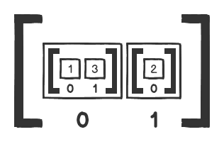
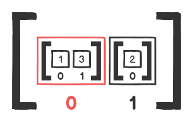
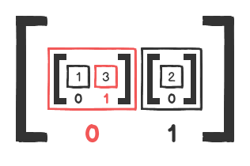

# Nested Data Structures

It's not uncommon for collections to contain other collections. Let's explore a few examples which illustrate how to work with nested data structures.

## **Referencing collection elements**
Here we have an array that contains two separate arrays: `[1, 3]` and `[2]`.
```javascript
  let arr = [[1, 3], [2]];
```
Each inner array has its own index even though they are both inside another array.


Each inner array can be accessed in the same way that you would access an other array element. The trick is to remember that it's another collection you are referencing.
```javascript
  arr[0]; // => [ 1, 3 ]
```


Let's get integer `3` from the inner array:
```javascript
  // here we are chaining our element references
  arr[0][1]; // => 3
```


&nbsp;
