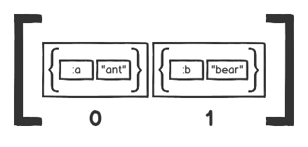
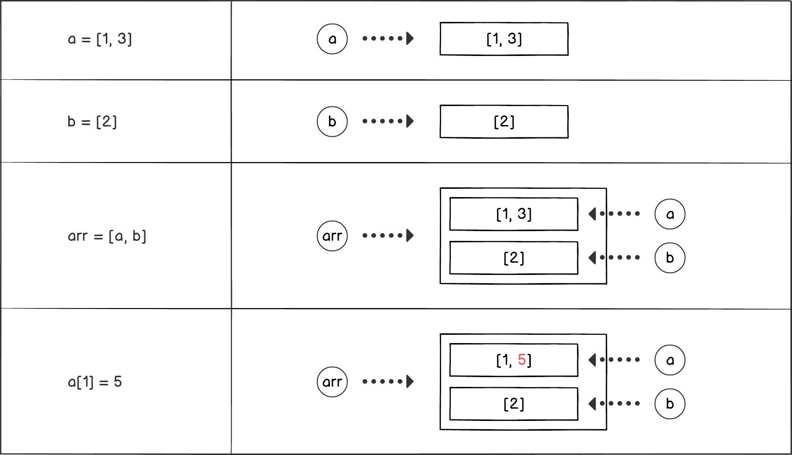
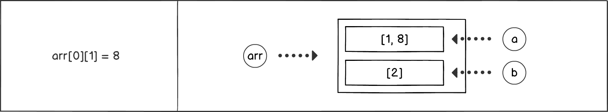

# Nested Data Structures

It's not uncommon for collections to contain other collections. Let's explore a few examples which illustrate how to work with nested data structures.

## **Referencing collection elements**
Here we have an array that contains two separate arrays: `[1, 3]` and `[2]`.
```javascript
  let arr = [[1, 3], [2]];
```
Each inner array has its own index even though they are both inside another array.


Each inner array can be accessed in the same way that you would access an other array element. The trick is to remember that it's another collection you are referencing.
```javascript
  arr[0]; // => [ 1, 3 ]
```


Let's get integer `3` from the inner array:
```javascript
  // here we are chaining our element references
  arr[0][1]; // => 3
```


&nbsp;

## **Updating collection elements**

**Update array element:**
```javascript
  let arr = [[1, 3], [2]];
  // parmanently changed the value of element at index 1
  arr[1] = 'hi there';
  arr; // => [ [1, 3], 'hi there' ]
```

**Modify a value in nested array:**
```javascript
  let arr = [[1, 3], [2]]
  // changing value in nested array is the same
  arr[0][1] = 5;
  // [ [1, 5], [2] ]
```
Let's see what is happening:  
`arr[0][1] = 5` is a chained action, first part is element reference and second part is element assignment  
Element Reference: `arr[0]` which gives us: `[1, 3]`  
Element Assignment: `[1] = 5` which changed the second element of the referenced element to `5`.

**Add aditional element into an inner array:**
```javascript
  let arr = [[1], [2]];

  arr[0].push(3);
  console.log(arr);
  // => [ [1, 3], [2] ]

  // we can add any value like another array
  arr[0].push([4]);
  console.log(arr);
  // => [ [ 1, 3, [ 4 ] ], [2] ] (three layer nested data structure)
```

&nbsp;

## **Other nested structures**

Objects can be nested within arrays as well:

```javascript
  [{ a: 'ant' }, { b: 'bear' }];
```


**Let's add new/key value pair to the first inner object:**  
Once again there has to be a two step process:  
1. reference the first element of the array
2. update the object

```javascript
  let arr = [{ a: 'ant' }, { b: 'bear' }];

  arr[0]['c'] = 'cat';
  arr[0].d = 'dog'
  console.log(arr);
  // => [{ a: 'ant', c: 'cat', d: 'dog' }, { b: 'bear' }]
```

**Arrays can hold multiple different objects at the same time, including nested data structures:**
```javascript
  let arr = [['a', ['b']], { b: 'bear', c: 'cat' }, 'cab'];

  // Let's retrieve elements
  arr[0]; // => [ 'a', [ 'b' ] ]
  arr[0][1][0]; // => 'b'
  arr[1]; // => { b: 'bear', c: 'cat' }
  arr[1]['b']; // => 'bear'
  arr[1].b[1]; // => 'e'
  arr[2][1]; // => 'a'
```

&nbsp;

## **Variable reference for a nested collections**
Let's have a look at this code:
```javascript
  let a = [1, 3];
  let b = [2];
  let arr = [a, b];
  console.log(arr); // => [ [ 1, 3 ], [ 2 ] ]
```
The local variables `a` and `b` are pointing to Array object. When we place the local variables as elements in an array, the result looks the same as adding the actual Array objects to which they refer to the array.

What happens when we change the local variables or the elements of the array?
```javascript
  let a = [1, 3];
  let b = [2];
  let arr = [a, b];
  console.log(arr); // => [ [ 1, 3 ], [ 2 ] ]

  a[1] = 5;
  console.log(arr); // => [ [ 1, 5 ], [ 2 ] ]
```
The above code shows the change is seen in both value of `a` and element at index `0` off `arr`. This means that both `a` and `arr[0]` points to the same array.



Now if modify the first element in the array:
```javascript
  arr[0][1] = 8;
  console.log(arr); // => [ [ 1, 8 ], [ 2 ] ]
  console.log(a); // => [ 1, 8 ]
```
It produces the same result as modifying `a` directly.  
`arr[0][1] = 8` is equivelent to `a[1] = 8`  
Let's see that in the diagram:


&nbsp;

## **Shallow Copy**
Copying only the top level of an object. When the object contains other objects, like nested array, then those objects are shared not copied.

## Shallow Copying Arrays:
Using `Array.prototype.slice()` without arguments:
```javascript
  let arr = ['a', 'b', 'c'];
  let copyOfArray = arr.slice();
  console.log(copyOfArr); // => [ 'a', 'b', 'c' ]
```
Using es6 **spread syntax (...)**:
```javascript
  let arr = ['a', 'b', 'c'];
  // ... expand an array to a list of values
  let copyOfArray = [...arr];
  console.log(copyOfArray); // => [ 'a', 'b', 'c' ]
```
Nested arrays:
```javascript
  let arr = [['a'], ['b'], ['c']];
  let copyOfArray = arr.slice();

  // this will update arr[1] too
  copyOfArray[1].push('d');

 // See:
  console.log(arr); // => [ [ 'a' ], [ 'b', 'd' ], [ 'c' ]]
  console.log(copyOfArray); // => [ [ 'a' ], [ 'b', 'd' ], [ 'c' ]]
```
Both `arr` and `copyOfArray` share the nested arrays. We can remove or add more elements to `arr` and `copyOfArray` without affecting one another. But the change in the shared arrays will be refelected by both.

&nbsp;

## Shallow Copying Object:
We can use `Object.assign` to copy properties of one or more objects into another.
```javascript
  let obj1 = { a: 'a' }
  let obj2 = { b: 'b' }
  
  Object.assign(obj1, obj2);
  console.log(obj1); // => { a: 'a', b: 'b' }
```

Copying into a new object:
```javascript
  let obj = { a: 'ant', b: 'bear' };
  let copyOfObj = Object.assign({}, obj);

  copyOfObj.c = 'cat';
  console.log(obj); // => { a: 'ant', b: 'bear' }
  console.log(copyOfObj); // => { a: 'ant', b: 'bear', c: 'cat' }
```

## Deep Copy
There is no method in JavaScript for deep copy. But there is an indirect way. However, it only works with nested arrays and plain objects. Objects that have methods and complex objects like dates or custom objects cannot be deep cloned.

```javascript
  let arr = [{ a: 'ant' }, ['bar']];
  let serialisedArr = JSON.stringify(arr);
  let deepCoppiedArr - JSON.parse(serialisedArr);
```

## Freezing Objects
You can freez objects, meaning make it unmodifiable. How ever this only freezes the top level objects not the nested ones.

```javascript
  let obj - Object.freeze({ a: 'ant' });
  let arr = Object.freeze(['a', 'b' , 'c']);

  obj['b'] = 'bear'; // fails silently
  console.log(obj); // => { a: 'ant' }

  arr.push('d'); // => TypeError: Cannot add property 3, object is not extensible
  console.log(arr); // => [ 'a', 'b', 'c' ]
```

NOTE: Only mutable object can be frozen with `Object.freeze`.